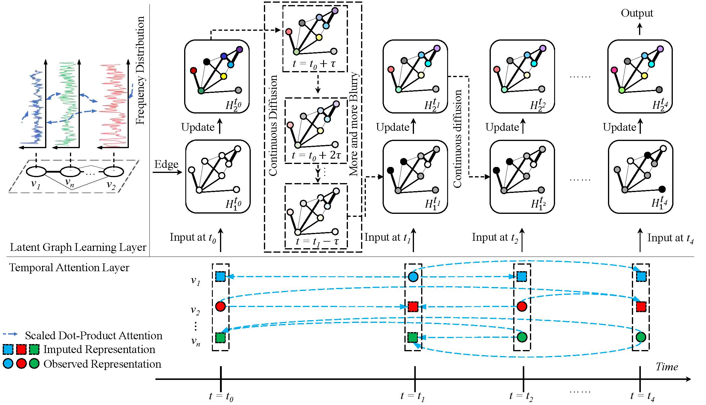

### Continuous Graph Unit for Irregular Multivariate Time Series Classification

This repository contains the PyTorch implementation for the paper [Continuous Graph Unit for Irregular Multivariate Time Series Classification ](https://openreview.net/forum?id=Jmo1yr8acL).

    

## Training and Evaluation

1. Basic Classification of CGU

`python CGU_train.py --dataset physionet --epochs 10 --batch_size 96 --early_stop_epochs 5 --attention_d_model 128 --graph_node_d_model 64 `

`python CGU_train.py --dataset P12 --epochs 10 --batch_size 96 --early_stop_epochs 5 --attention_d_model 128 --graph_node_d_model 64 `

`python CGU_train.py --dataset P19 --epochs 10 --batch_size 96 --early_stop_epochs 5 --attention_d_model 128 --graph_node_d_model 64 --varatt_dim 256 `

`python CGU_train.py --dataset PAM --lr 0.005 --batch_size 128 --epochs 20 --early_stop_epochs 20 --attention_d_model 64 --graph_node_d_model 32 --at 1 --bt 1e-3  `

2. Extra Timestamp Discard Classification of CGU

`python CGU_missing.py --dataset physionet --epochs 20 --batch_size 96 --early_stop_epochs 20 --attention_d_model 128 --graph_node_d_model 64 --beta_start 0.0001 --beta_end 0.0002 --missingtype time ` 

`python CGU_missing.py --dataset P12 --epochs 20 --batch_size 96 --early_stop_epochs 20 --attention_d_model 128 --graph_node_d_model 64 --missingtype time` 

`python CGU_missing.py --dataset P19 --epochs 20 --batch_size 96 --early_stop_epochs 5 --attention_d_model 128 --graph_node_d_model 64 --varatt_dim 256 --missingtype time `

`python CGU_missing.py --dataset PAM --lr 0.005 --batch_size 128 --epochs 20 --early_stop_epochs 20 --attention_d_model 64 --graph_node_d_model 32 --missingtype time --at 1 --bt 1e-3  ` 

3. Basic Classification of Baselines

`cd baselines`

`python baselines_train.py --dataset PAM --lr 0.001 --batch_size 64 --baseline mTAND --epochs 20` 

`python baselines_train.py --dataset PAM --lr 0.001 --batch_size 64 --baseline GRUD --epochs 20` 

4. Extra Timestamp Discard Classification of Baselines

`python baselines_train_missing.py --dataset PAM --lr 0.001 --batch_size 128 --missingtype time --baseline mTAND --epochs 20` 

`python baselines_train_missing.py --dataset PAM --lr 0.001 --batch_size 128 --missingtype time --baseline RAINDROP --epochs 20` 

5. Basic Classification of ODE-RNN

`python baselines_train_missing_ode_rnn.py --dataset PAM --lr 0.001 --batch_size 128 --epochs 20` 

6. Extra Timestamp Discard Classification of ODE-RNN

`python baselines_train_missing_ode_rnn.py --dataset PAM --lr 0.001 --missingtype time --batch_size 128 --epochs 20` 

7. Basic Classification of IP-Net

`python origin_IP_Net.py --dataset PAM --e 20` 

8. Extra Timestamp Discard Classification of IP-Net

`python origin_IP_Net_missing.py --dataset PAM --e 20` 